# openEHR AQL Manager

This webpage can be used to store and format openEHR compliant AQL queries.

## Disclaimer
AQL Manager (“the Software”) is provided as an open‑source project on an “AS IS” and “AS AVAILABLE” basis, without any warranties of any kind, express or implied.

To the maximum extent permitted by applicable law, the authors and contributors of the Software disclaim all warranties, including, but not limited to, implied warranties of merchantability, fitness for a particular purpose, non‑infringement, and any warranties arising out of course of dealing or usage of trade.

The Software is intended for use by technically competent users. You are solely responsible for:
- Evaluating the accuracy, completeness, and suitability of the Software for your use case.
- Validating all queries, configurations, and outputs before using them in production or on live data.
- Maintaining appropriate backups, security controls, and access restrictions for any systems or data used with the Software.

In no event shall the authors or contributors be liable for any claim, damages, or other liability, whether in an action of contract, tort, or otherwise, arising from, out of, or in connection with the Software or the use of, or other dealings in, the Software. This includes, without limitation, any loss or corruption of data, business interruption, security breach, or other indirect, incidental, special, exemplary, or consequential damages.

By using the Software, you agree that you do so at your own risk and that you will comply with all applicable laws, regulations, and internal policies governing your use of the Software and any associated data.

## Precautions

Take into account: 
- Reloading the HTML page might make you loose your progress. Please save often!
- Be aware that changes to your AQL collection get saved in a new file everytime you save. Be sure to keep the last downloaded file for your next session.

## GUI overview

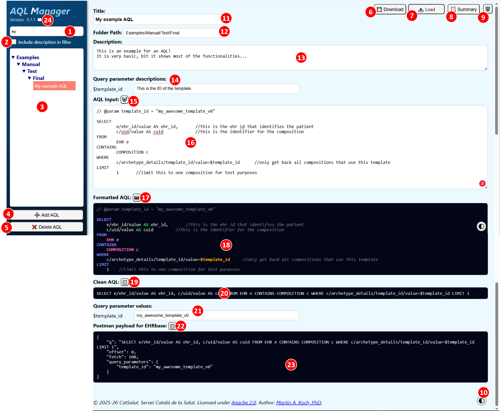

**Elements of the User Interface**
1. Input: AQL list is filtered by the input
2. Checkbox: Includes the description of the AQL in the filter
3. List of AQL currently in memory
4. Button: Add a new AQL to the list
5. Button: Delete the selected AQL
6. Button: Upload an AQL collection from a local JSON file
7. Button: Download the whole AQL collection
8. Button: Create a text summary of the current AQL
9. Button: Clear local storage
10. Button: Switch between dark and light mode for the formatted AQLs 
11. Input: Title of the selected AQL
12. Input: Folder path. For example "Examples/Test/final/"
13. Input: Description of the selected AQL
14. Input: Input: If variables have been defined in the AQL editor, descriptions for the variable can be added.
15. Button: Auto-format the AQL input field
16. Input: Editor for the AQL
17. Button: Download an image of the formatted AQL
18. Output: AQL with highlighted keywords
19. Button: Copy the cleaned up AQL to the clipboard
20. Output: Cleaned up AQL as a online text without tabs or comments
21. Input: If variables have been defined in the AQL editor, example values for the variable can be applied.
22. Button: Copy the AQL formatted as payload for EHRbase to the clipboard
23. Output: AQL formatted as payload for EHRbase
24. Link: Open user manual in a new browser tab.

## User Guide

### Starting from scratch
### Adding an AQL
Press the "Add AQL" button to add a new AQL to the list.

You get a new empty AQL in the main section. 

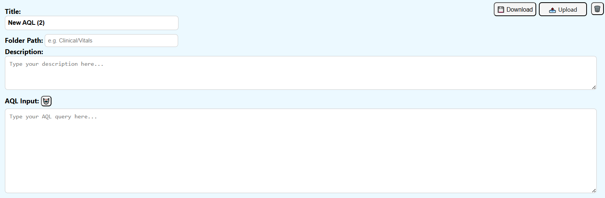

New AQLs are in the "Unsorted" section of the AQL list. You can determine in which folder the AQL is located by changing the "Folder Path". Fopr example "Examples/Manual/Test/Final" will move the AQL to the location.

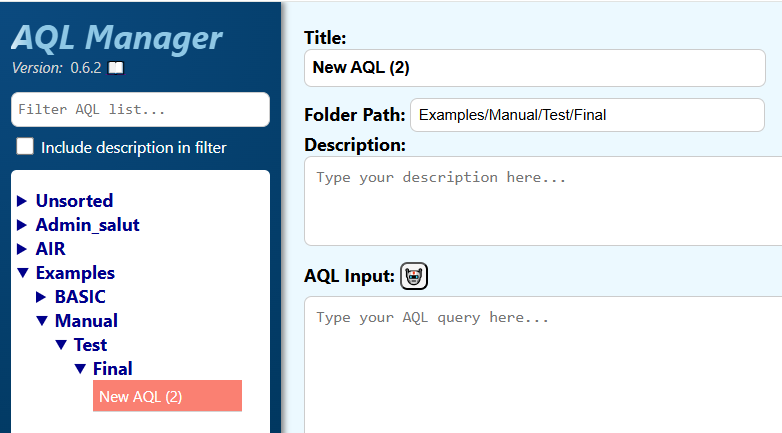

Change the title, the description and finally add your AQL to the "AQL Input".

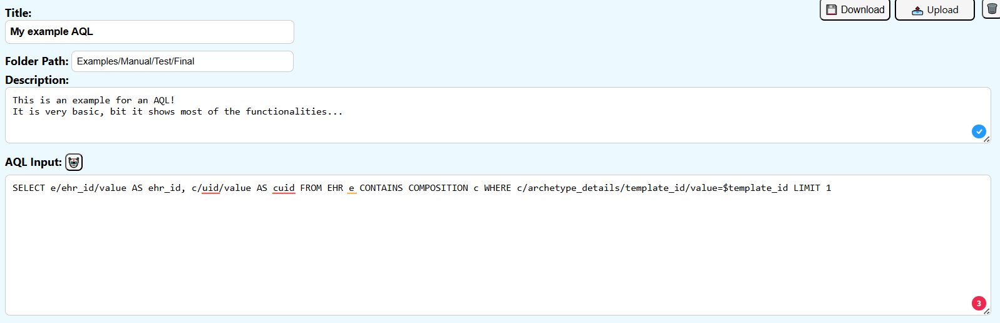

### Formatting an AQL
#### Auto-Formatting 

For formatting your AQL, you can press the "auto-format" button. 

This will create a fast first format, that adds line breaks and tabs before and after certain keywords.

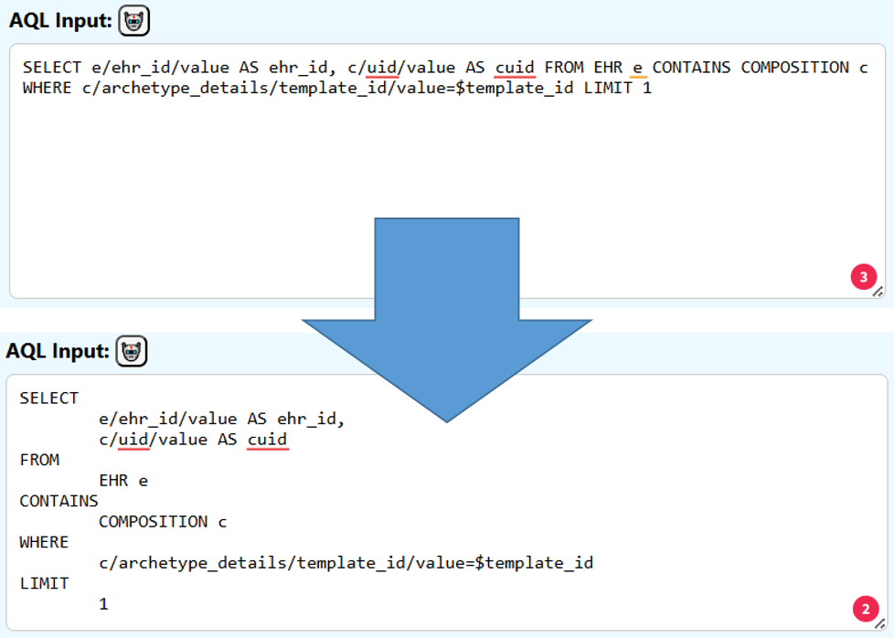

#### Manual Formatting
You can format your AQL input with line breaks, spaces and tabs. 

You can use the auto-format button to enter automatically line breaks at the major keywords. 

Use "//" to enter comments.

Use "$" to add variables (for example "$ehr_id").

You can optionally add values for these parameters by adding comments in the format of <strong>// @param template_id = "my_awesome_template_v0"</strong>.

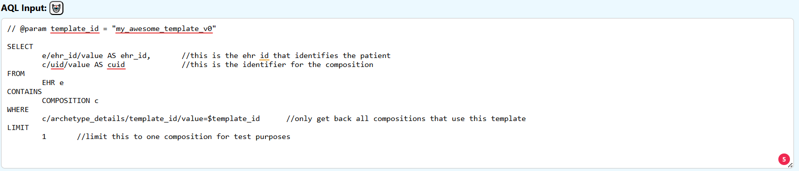

#### Formatted AQL
The "Formatted AQL" section shows you a version of the input AQL with keyword highlights. The style can be changed between "dark" and "light" by pressing the style button. 

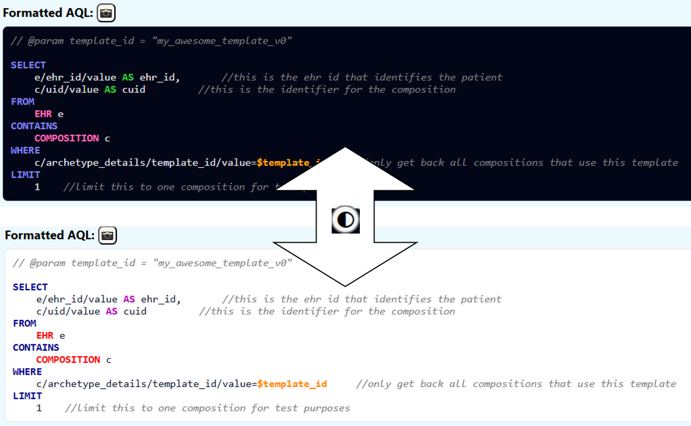

The following text gets highlighted:
- parameters starting with "$"
- ['SELECT',  'FROM', 'CONTAINS', 'WHERE', 'ORDER BY', 'LIMIT', 'OFFSET']
- ['VERSION','EHR', 'CONTENT_ITEM', 'ENTRY', 'CARE_ENTRY', 'EVENT', 'ITEM_STRUCTURE', 'ITEM', 'COMPOSITION', 'FOLDER', 'EHR_STATUS', 'EVENT_CONTEXT', 'SECTION', 'GENERIC_ENTRY', 'ADMIN_ENTRY', 'OBSERVATION', 'INSTRUCTION', 'ACTION', 'EVALUATION', 'ACTIVITY', 'HISTORY', 'POINT_EVENT', 'INTERVAL_EVENT', 'ITEM_LIST', 'ITEM_SINGLE', 'ITEM_TABLE', 'ITEM_TREE', 'CLUSTER', 'ELEMENT']
- ['DESC','ASC','AS','DISTINCT', 'AND', 'OR', 'NOT', 'LIKE', 'matches', 'exists', '<', '>', '=', '!', 'true', 'false', 'NULL']
- in line comments that start with "//"

This view of the AQL can be exported as a PNG file. Press the snapshot button:

Automatically the image gets downloaded as "formatted_aql.png".

#### Clean AQL
For many applications an AQL without line breaks, tabs or comments is needed. Therefore we present a cleaned up version in the "Clean AQL" section:
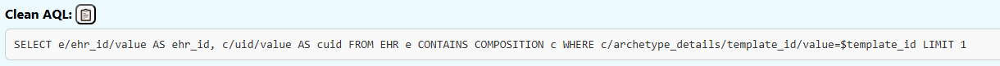

This AQL can be copied to the clipboard by pressing the "copy to clipboard" button:

#### Pre-formatted payload for EHRbase

For the use of the AQL for EHRbase via Postman, for example, the AQL has to be included in a JSON structure. For your convenience, this is done in the "Postman payload for EHRbase" section.

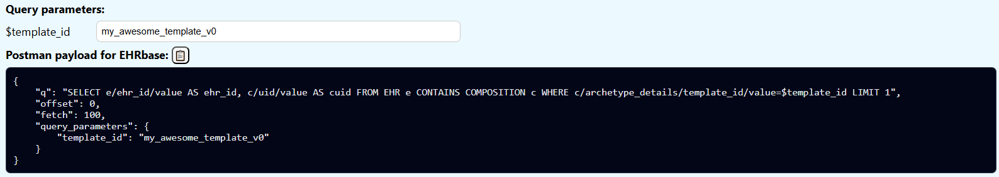

If previously query parameters have been defined in the AQL (for example "$template_id"), a value for this query parameter can be added in the "Query parameters" section. 

This AQL payload can be copied to the clipboard by pressing the "copy to clipboard" button:

### Delete an AQL
To delete an AQL from the collection, select the AQL you want to delete in the list on the left hand side.

Press the "Delete AQL" button to delete the AQL:

### Changing an AQL
To modify an AQL, select the AQL you want to change in the list on the left hand side.

When an AQL is selected you can make changes to the title, description and input.

Don't forget to save the selection after making changes.  

### Searching for an AQL
You can filter the list of AQL on the left hand side, by typing in the search bar above the list.
By default, only the AQL titles are filtered. You can select the "Include description in filter" checkbox to include also the AQL descriptions in the filter.

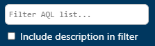

### Starting with an AQL collection
Instead of starting from scratch, you can load a JSON file with an AQL collection. Use the "Select file" button to do so:

Note that the format of the saved file has to be a list of elements that have 5 attributes: title, description, AQL, folder path and query parameter values:

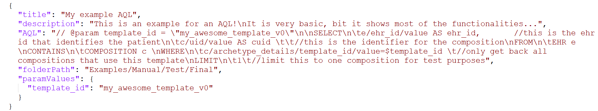

### Saving the AQL collection
Use the "Download AQL collection" button to download the whole AQL collection:

The whole AQL selection gets saved in a "aql_store_file.json" file. If this file already exists, a new file with "(N)" added to the name:

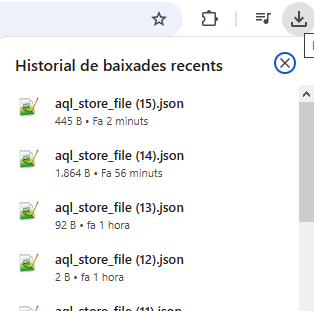

⚠️The save button does not "update" a local file selected previsously. Be sure to save the downloaded AQL collection for a future session.

The format of the saved file is a list of elements that have 5 attributes: title, description, AQL, folder path and query parameter values:

### Deleting the local browser storage
The webpage uses the local storage of the web browser, so nothing gets lost when you close or reload the page. 
If you want to delete the AQL data in local storage, you can do so with the "Clear Local Storage" button:

## License
© 2026 CatSalut. Servei Català de la Salut. Licensed under Apache 2.0. Author: Martin A. Koch, PhD.